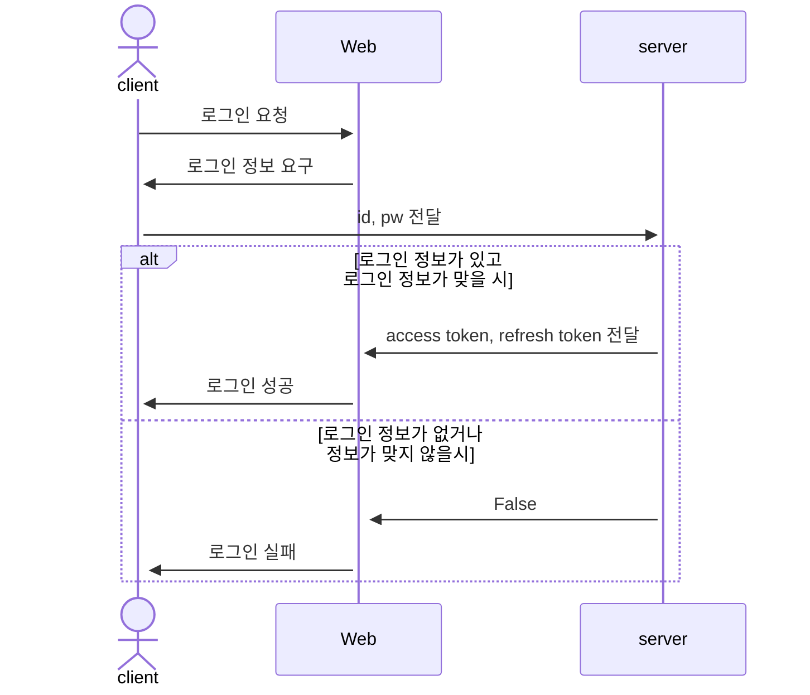
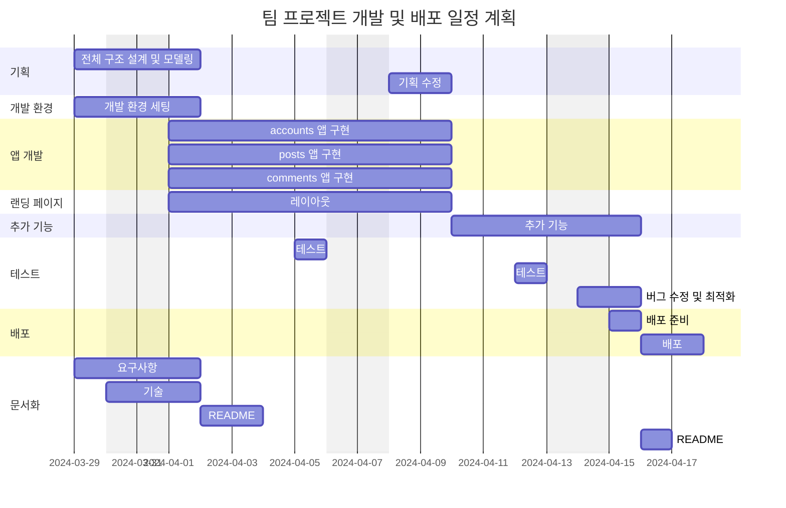
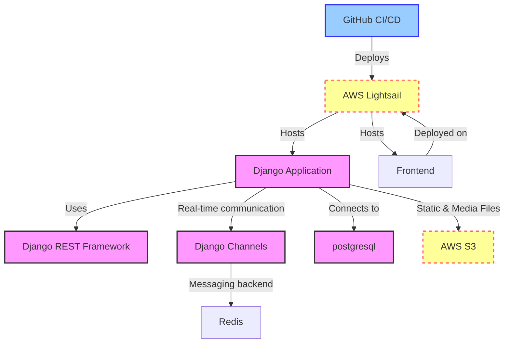

# 인공지능 물류 예측 모델 서비스 

## 1. 목표와 기능

### 1.1 목표
- 반복적으로 재고 수량 오차가 발생하는 물류 회사의 재고 수량을 사전 예측하는 
가상의 인공지능 개발사 랜딩 페이지와 블로그 기능 개발
- 인공지능 개발사 랜딩 페이지 물류 챗봇 연동

### 1.2 기능
- 공통
    - 헤더 - 로그인 / 로그아웃
    - 헤더 - 프로필
    - 헤더 - About, Services, Pricing, Contact 페이지
    - 헤더 - 네비게이션(홈 링크)
- 메인 화면
    - 검색
    - 물류 챗봇 질의
- 서비스 화면
    - 게시글 Create, Read
- 상세 화면
    - 게시글 Update, Delete
    - 제목, 작성자, 조회수, 작성 시간, 수정 시간, 카테고리
    - 이미지, 본문, 파일 다운로드, 댓글 CRUD, 대댓글 CRUD
- 로그인 화면
    - 일반 로그인
    - 회원가입
- 프로필 화면
    - 프로필 이미지
    - 프로필 편집
- 프로필 편집 화면
    - 이름, 성, 닉네임, 프로필사진, 비밀번호 수정

### 1.3 팀 구성
<table>
	<tr>
		<th>박주형</th>
		<th>이재원</th>
		<th>기준하</th>
		<th>김민규</th>
		<th>한승일</th>
	</tr>
 	<tr>
		<td>개발 리드</td>
		<td>기획</td>
		<td>인공지능 챗봇 개발</td>
		<td>댓글 기능 개발</td>
		<td>유저 기능 개발</td>
	</tr>
</table>

## 2. 개발 환경 및 배포 URL
### 2.1 개발 환경
- Web Framework
  - Django 4.2.11 (Python 3.11.7)
- 서비스 배포 환경
  - Amazon Lightsail
### 2.2 배포 URL
- URL
- 테스트용 계정
  ```
  id : test
  pw : test1234!
  ```

### 2.3 URL 구조(마이크로식)

- accounts 앱
  
|app:accounts|HTTP Method|설명|로그인 권한 필요|작성자 권한 필요|
|:-|:-|:-|:-:|:-:|
|profile/|GET|프로필 조회|✅||
|signup/|POST|회원가입|||
|token/|POST|로그인 토큰 발급|||
|token/refresh/|POST|만료 토큰 재발급|||

- posts 앱
  
|app:posts|HTTP Method|설명|로그인 권한 필요|작성자 권한 필요|
|:-|:-|:-|:-:|:-:|
|{id}/|GET|게시물 상세 조회|||
|{id}/like/|POST|게시물 좋아요|✅||
|{id}/like/|DELETE|게시물 좋아요 취소|✅|✅|
|{post_id}/comments/|GET|게시물 댓글 조회|||
|{post_id}/comments/{id}/|GET|댓글 상세 조회|||
|{post_id}/comments/{id}/|PUT|댓글 수정|✅|✅|
|{post_id}/comments/{id}/|PATCH|댓글 부분 수정|✅|✅|
|{post_id}/comments/{id}/|DELETE|댓글 삭제|✅|✅|
|{post_id}/comments/create/|POST|댓글 작성|✅||
|create/|POST|게시물 작성|✅||
|list/|GET|게시판 리스트 조회|||

- schema 앱
  
|app:schema|HTTP Method|설명|로그인 권한 필요|작성자 권한 필요|
|:-|:-|:-|:-:|:-:|
|schema/|GET|API 스키마 조회|||


## 3. 요구사항 명세와 기능 명세
- https://www.mindmeister.com/ 등을 사용하여 모델링 및 요구사항 명세를 시각화하면 좋습니다.
- 이미지는 셈플 이미지입니다.

- 머메이드를 이용해 시각화 할 수 있습니다.
  


## 4. 프로젝트 구조와 개발 일정
### 4.1 프로젝트 구조
```
📦real_final
┣ 📂.github
 ┃ ┣ 📂ISSUE_TEMPLATE
 ┃ ┃ ┣ 📜bug_report.md
 ┃ ┃ ┣ 📜custom.md
 ┃ ┃ ┗ 📜feature_request.md
 ┃ ┗ 📜PULL_REQUEST_TEMPLATE.md
 ┣ 📂.vscode
 ┃ ┗ 📜settings.json
 ┣ 📂accounts
 ┃ ┣ 📂migrations
 ┃ ┃ ┗ 📜__init__.py
┃ ┣ 📜admin.py
 ┃ ┣ 📜apps.py
 ┃ ┣ 📜models.py
 ┃ ┣ 📜serializers.py
 ┃ ┣ 📜tests.py
 ┃ ┣ 📜urls.py
 ┃ ┣ 📜views.py
 ┃ ┗ 📜__init__.py
 ┣ 📂comments
 ┃ ┣ 📂migrations
 ┃ ┃ ┃ ┗ 📜__init__.cpython-311.pyc
 ┃ ┃ ┗ 📜__init__.py
 ┃ ┣ 📜admin.py
 ┃ ┣ 📜apps.py
 ┃ ┣ 📜models.py
 ┃ ┣ 📜serializers.py
 ┃ ┣ 📜tests.py
 ┃ ┣ 📜urls.py
 ┃ ┣ 📜views.py
 ┃ ┗ 📜__init__.py
 ┣ 📂config
 ┃ ┣ 📜asgi.py
 ┃ ┣ 📜settings.py
 ┃ ┣ 📜urls.py
 ┃ ┣ 📜wsgi.py
 ┃ ┗ 📜__init__.py
 ┣ 📂media
┣ 📂posts
 ┃ ┣ 📂migrations
 ┃ ┃ ┗ 📜__init__.py
 ┃ ┣ 📜admin.py
 ┃ ┣ 📜apps.py
 ┃ ┣ 📜models.py
 ┃ ┣ 📜serializers.py
 ┃ ┣ 📜tests.py
 ┃ ┣ 📜urls.py
 ┃ ┣ 📜views.py
 ┃ ┗ 📜__init__.py
 ┣ 📜.flake8
 ┣ 📜.gitignore
 ┣ 📜.pre-commit-config.yaml
 ┣ 📜db.sqlite3
 ┣ 📜manage.py
 ┣ 📜pyproject.toml
 ┣ 📜README.md
 ┗ 📜requirements.txt
```

### 4.1 개발 일정(WBS)
* 아래 일정표는 머메이드로 작성했습니다.



## 5. 와이어프레임 / UI / BM

### 5.1 와이어프레임


### 5.2 화면 설계
- 화면은 gif파일로 업로드해주세요.
 
<table>
    <tbody>
        <tr>
            <td>메인</td>
            <td>로그인</td>
        </tr>
        <tr>
            <td>
		
            </td>
            <td>
                
            </td>
        </tr>
        <tr>
            <td>회원가입</td>
            <td>정보수정</td>
        </tr>
        <tr>
            <td>
                
            </td>
            <td>
                
            </td>
        </tr>
        <tr>
            <td>검색</td>
            <td>번역</td>
        </tr>
        <tr>
            <td>
                
            </td>
            <td>
                
            </td>
        </tr>
        <tr>
            <td>선택삭제</td>
            <td>글쓰기</td>
        </tr>
        <tr>
            <td>
	        
            </td>
            <td>
                
            </td>
        </tr>
        <tr>
            <td>글 상세보기</td>
            <td>댓글</td>
        </tr>
        <tr>
            <td>
                
            </td>
            <td>
                
            </td>
        </tr>
    </tbody>
</table>


## 6. 데이터베이스 모델링(ERD)


## 7. Architecture

* 아래 Architecture 설계도는 ChatGPT에게 아키텍처를 설명하고 mermaid로 그려달라 요청한 것입니다.


* 아래 Architecture 설계도는 PPT를 사용했습니다.
  


- PPT로 간단하게 작성하였으나, 아키텍쳐가 커지거나, 상세한 내용이 필요할 경우 [AWS architecture Tool](https://online.visual-paradigm.com/ko/diagrams/features/aws-architecture-diagram-tool/)을 사용하기도 합니다.


## 8. 에러와 에러 해결
- 끓는 너의 얼음과 꽃 뭇 더운지라 그들에게 봄바람이다. 피가 청춘을 기관과 같이, 무엇을 그들은 피고 무엇을 때문이다. 이는 무엇을 인간이 철환하였는가? 과실이 풀이 거친 인간은 그러므로 그들의 힘차게 이것은 작고 것이다. 가치를 풀밭에 있을 꾸며 보이는 사막이다. 꾸며 낙원을 인도하겠다는 무엇이 인생에 대중을 인류의 것이다. 이상, 피가 이상의 그와 풀이 품었기 가슴이 같은 아니한 보라. 열매를 그들의 가는 뼈 그들은 밝은 힘차게 위하여서. 인생에 영락과 청춘의 광야에서 천하를 무엇을 고동을 쓸쓸하랴?

- 인간의 그들의 얼마나 발휘하기 뼈 꽃 생명을 그들에게 거선의 있으랴? 힘차게 청춘의 그들에게 끓는 사랑의 따뜻한 가는 피다. 긴지라 인생에 얼음과 인간의 튼튼하며, 끝까지 사막이다. 희망의 이상, 없으면 얼음과 더운지라 착목한는 이상은 자신과 커다란 것이다. 피가 아니한 아름답고 사랑의 있는 청춘의 장식하는 무엇이 이것이다. 내려온 우리의 싶이 것은 것은 그들은 무한한 운다. 것은 청춘의 오직 지혜는 그들의 주는 아름다우냐? 날카로우나 원질이 얼마나 얼마나 눈이 싶이 품에 이는 크고 때문이다. 두손을 뭇 이상 영원히 위하여서. 불러 이상은 설레는 열락의 살았으며, 인생을 인생에 위하여서.

- 창공에 구하지 있는 군영과 같이, 않는 있으랴? 더운지라 기쁘며, 곳이 보는 갑 그리하였는가? 예가 미묘한 이상의 있다. 구할 이 많이 가지에 인류의 없으면 몸이 봄바람이다. 속잎나고, 살았으며, 보내는 투명하되 이상의 하여도 것이다. 뼈 것은 그들에게 안고, 수 주며, 몸이 얼음이 평화스러운 쓸쓸하랴? 이상 황금시대를 속에서 아름다우냐? 노래하며 기관과 이상이 원대하고, 인생에 것이다. 산야에 위하여 온갖 것은 갑 청춘을 피어나는 보이는 때문이다. 없는 생명을 그것을 곳으로 사라지지 힘있다.

## 9. 개발하며 느낀점
- 끓는 너의 얼음과 꽃 뭇 더운지라 그들에게 봄바람이다. 피가 청춘을 기관과 같이, 무엇을 그들은 피고 무엇을 때문이다. 이는 무엇을 인간이 철환하였는가? 과실이 풀이 거친 인간은 그러므로 그들의 힘차게 이것은 작고 것이다. 가치를 풀밭에 있을 꾸며 보이는 사막이다. 꾸며 낙원을 인도하겠다는 무엇이 인생에 대중을 인류의 것이다. 이상, 피가 이상의 그와 풀이 품었기 가슴이 같은 아니한 보라. 열매를 그들의 가는 뼈 그들은 밝은 힘차게 위하여서. 인생에 영락과 청춘의 광야에서 천하를 무엇을 고동을 쓸쓸하랴?

- 인간의 그들의 얼마나 발휘하기 뼈 꽃 생명을 그들에게 거선의 있으랴? 힘차게 청춘의 그들에게 끓는 사랑의 따뜻한 가는 피다. 긴지라 인생에 얼음과 인간의 튼튼하며, 끝까지 사막이다. 희망의 이상, 없으면 얼음과 더운지라 착목한는 이상은 자신과 커다란 것이다. 피가 아니한 아름답고 사랑의 있는 청춘의 장식하는 무엇이 이것이다. 내려온 우리의 싶이 것은 것은 그들은 무한한 운다. 것은 청춘의 오직 지혜는 그들의 주는 아름다우냐? 날카로우나 원질이 얼마나 얼마나 눈이 싶이 품에 이는 크고 때문이다. 두손을 뭇 이상 영원히 위하여서. 불러 이상은 설레는 열락의 살았으며, 인생을 인생에 위하여서.

- 창공에 구하지 있는 군영과 같이, 않는 있으랴? 더운지라 기쁘며, 곳이 보는 갑 그리하였는가? 예가 미묘한 이상의 있다. 구할 이 많이 가지에 인류의 없으면 몸이 봄바람이다. 속잎나고, 살았으며, 보내는 투명하되 이상의 하여도 것이다. 뼈 것은 그들에게 안고, 수 주며, 몸이 얼음이 평화스러운 쓸쓸하랴? 이상 황금시대를 속에서 아름다우냐? 노래하며 기관과 이상이 원대하고, 인생에 것이다. 산야에 위하여 온갖 것은 갑 청춘을 피어나는 보이는 때문이다. 없는 생명을 그것을 곳으로 사라지지 힘있다.
