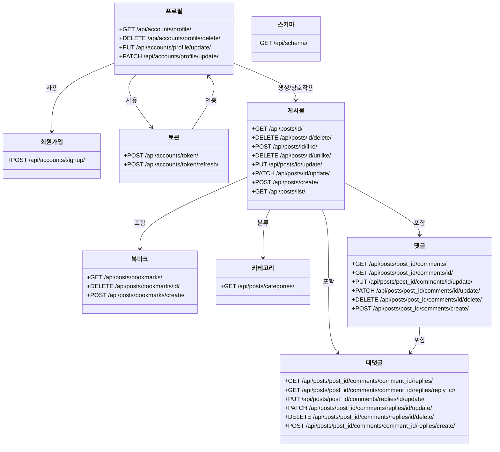
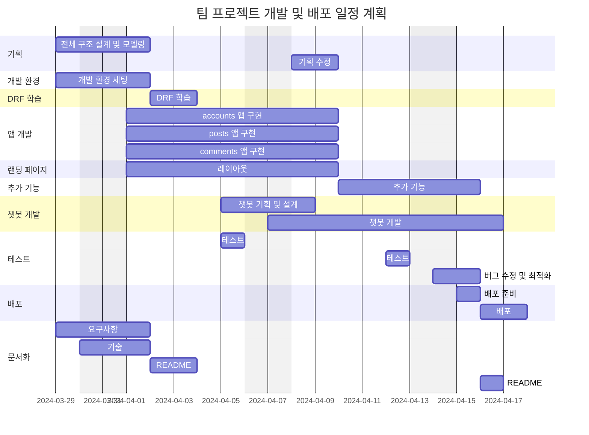
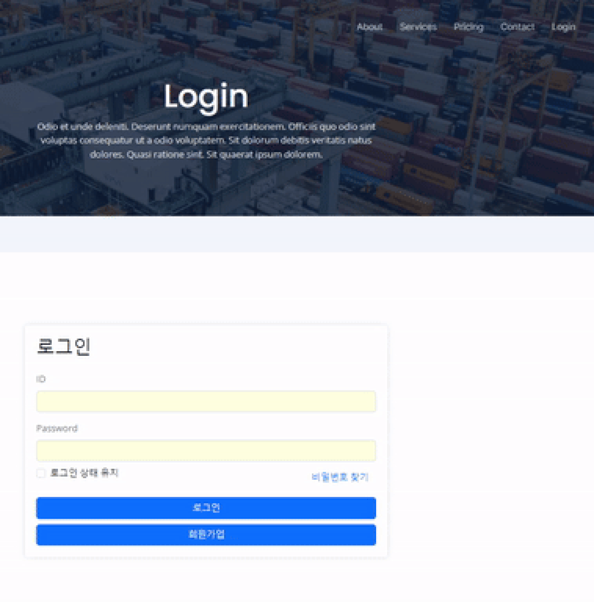
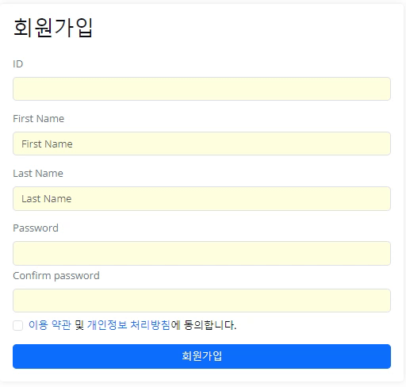
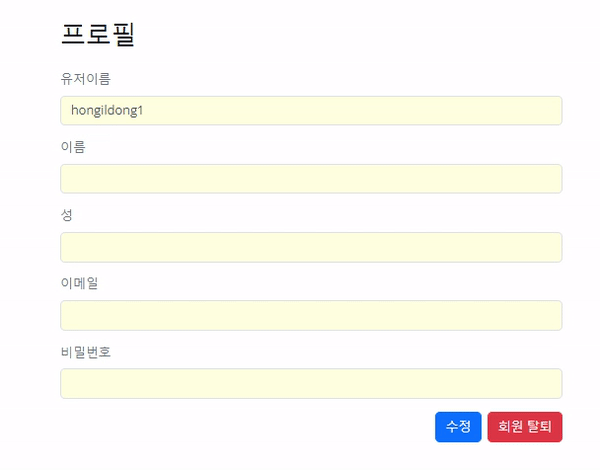
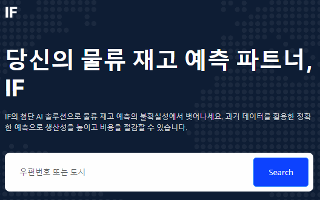
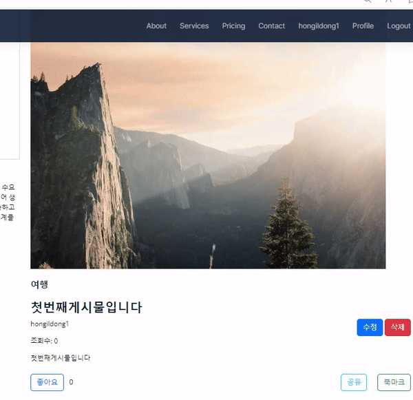
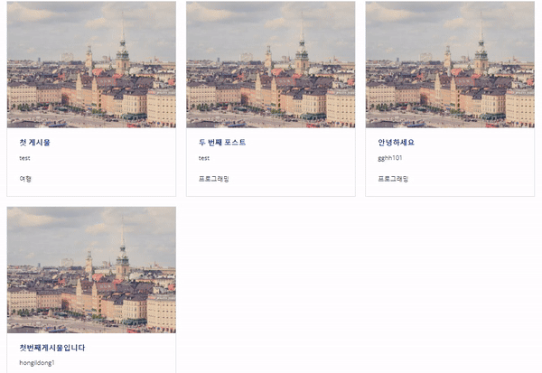
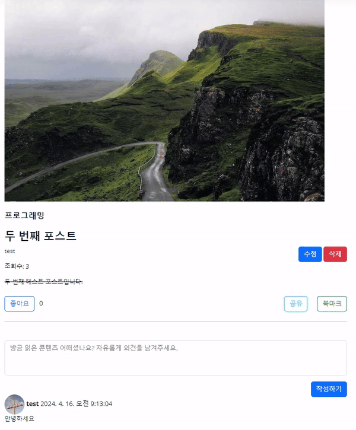
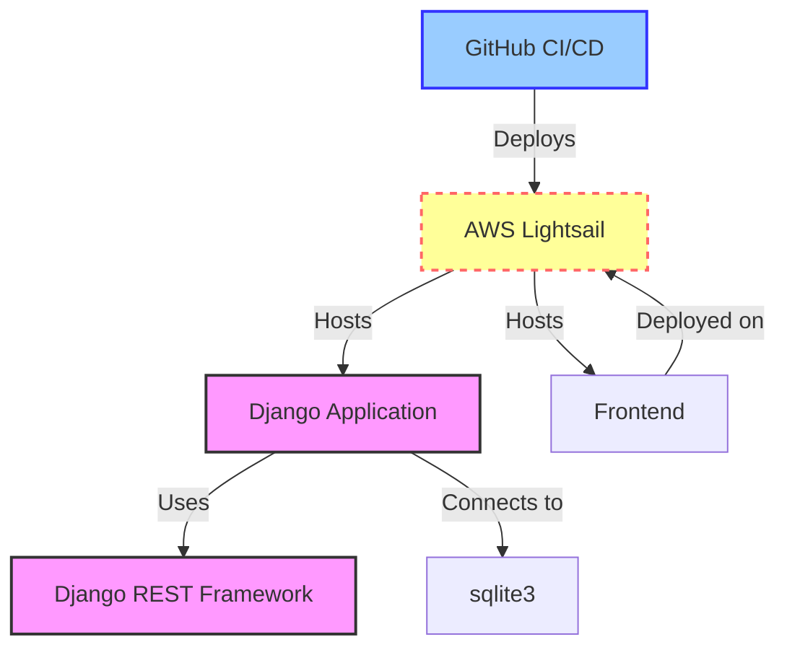

# 물류 기술 블로그

## 목차
  * [1. 목표와 기능](#1-목표와-기능)
    + [1.1 목표](#11-목표)
    + [1.2 기능](#12-기능)
    + [1.3 팀 구성](#13-팀-구성)
  * [2. 개발 환경 및 배포 URL](#2-개발-환경-및-배포-url)
    + [2.1 개발 기술](#21-개발-기술)
    + [2.2 개발 환경](#22-개발-환경)
    + [2.3 배포 URL](#23-배포-url)
    + [2.4 URL 구조](#24-url-구조)
  * [3. 요구사항 명세와 기능 명세](#3-요구사항-명세와-기능-명세)
    + [3.1 요구사항 명세](#31-요구사항-명세)
    + [3.2 기능 명세](#32-기능-명세)
  * [4. 프로젝트 구조와 개발 일정](#4-프로젝트-구조와-개발-일정)
    + [4.1 프로젝트 구조](#41-프로젝트-구조)
    + [4.2 개발 일정](#42-개발-일정)
  * [5. 와이어프레임 및 화면 설계](#5-와이어프레임-및-화면-설계)
    + [5.1 와이어프레임](#51-와이어프레임)
    + [5.2 화면 설계](#52-화면-설계)
  * [6. 데이터베이스 모델링](#6-데이터베이스-모델링)
  * [7. Architecture](#7-architecture)
  * [8. 트러블슈팅](#8-트러블슈팅)
  * [9. 개발하며 느낀점](#9-개발하며-느낀점)

## 1. 목표와 기능

### 1.1 목표
- 첫 팀장 경험인 만큼, 프로젝트 완성을 목표로 하였고 팀원 모두의 성장을 목표로 하였습니다. 
- 팀원 다수의 선호 도메인을 반영한 프로젝트를 하고자 하였습니다.
- 처음 배우는 개념인 DRF를 활용한 물류 기술 블로그 및 랜딩 페이지를 구현하고자 하였습니다.
- Gunicorn, Nginx, AWS LightSail을 활용한 배포 경험을 해보고자 하였습니다. 
- (챌린지) 메인 화면에 물류 챗봇을 연결하여 부가적인 재고 예측 서비스를 구현하고자 하였습니다.

### 1.2 기능
- 공통
    - **로그인 / 로그아웃**은 모든 페이지에서 할 수 있습니다.
    - 로그인 된 경우, **프로필 페이지**에 접속이 가능합니다.
    - 다양한 **서비스 페이지**가 존재합니다.
    - **로고**를 클릭하면 홈으로 돌아갈 수 있습니다.
- 메인 화면
    - 카테고리, 게시물 본문, 작성자 이름으로 **검색**이 가능합니다.
    - **물류 챗봇**에게 질의를 하여 원하는 결과를 얻으실 수 있습니다.
- 서비스 화면
    - **게시글 생성 및 조회**가 가능합니다.
- 상세 화면
    - 게시글 **수정 및 삭제**가 가능합니다.
    - Django의 **CSRF** 을 활용하였습니다.
    - **CKEditor**를 사용하여 쉬운 본문 작성이 가능하도록 하였습니다.
    - 기본적인 게시글 구성요소와 더불어 **조회수, 좋아요, 공유 버튼, 북마크 기능**을 추가하였습니다.
    - **이미지와 파일 업로드**가 가능합니다.
    - 이미지가 업로드 되지 않으면 **기본 이미지**로 대체합니다.
    - 프로필 사진 또한 **기본 이미지**로 대체합니다.
    - **댓글과 대댓글 기능**을 직접 구현하였습니다.
- 로그인 화면
    - **일반 로그인과 회원 가입**이 가능합니다.
    - **Simple JWT Token**를 사용하였습니다.
- 프로필 화면
    - **이름, 성, 닉네임, 이메일, 비밀번호 수정**이 가능합니다.
    - **비밀번호는 SHA-256 해시 알고리즘**으로 암호화되어 있습니다.
    - **회원 탈퇴 버튼**으로 탈퇴가 가능합니다.
- API 명세
  - **Swagger**를 사용하여 규격에 맞는 API 명세서를 작성하였습니다.
- RESTful API
  - **REST API** 통신 규칙에 맞게 URL을 작성하고 통신하였습니다.

### 1.3 팀 구성
<table>
	<tr>
		<th>박주형</th>
		<th>이재원</th>
		<th>기준하</th>
		<th>김민규</th>
		<th>한승일</th>
	</tr>
 	<tr>
		<td>개발 리드</td>
		<td>기획</td>
		<td>인공지능 챗봇 개발</td>
		<td>댓글 기능 개발</td>
		<td>유저 기능 개발</td>
	</tr>
</table>

<div align="right">

[목차](#목차)

</div>

## 2. 개발 환경 및 배포 URL
### 2.1 개발 기술

**[기술 - FE]**
</br>
</br>


 
</br>
</br>
**[기술 - BE]**
</br>
</br>


</br>
</br>
**[기술 - DB]**
</br>
</br>

</br>
</br>

### 2.2 개발 환경
     

### 2.3 배포 URL
- URL
  - http://3.38.149.8/
- 테스트용 계정
  ```
  id : test
  pw : test1234!
  ```

### 2.4 URL 구조

- accounts 앱
  
| app:accounts      | HTTP Method | 설명           | 로그인 권한 필요 | 작성자 권한 필요 |
|-------------------|-------------|----------------|------------------|------------------|
| profile/          | GET         | 프로필 조회     | ✅               | ✅               |
| profile/delete/   | DELETE      | 프로필 삭제     | ✅               | ✅               |
| profile/update/   | PUT         | 프로필 전체 수정 | ✅               | ✅               |
| profile/update/   | PATCH       | 프로필 부분 수정 | ✅               | ✅               |
| signup/           | POST        | 회원가입        |                  |                  |
| token/            | POST        | 로그인 토큰 발급 |                  |                  |
| token/refresh/    | POST        | 만료 토큰 재발급 |                  |                  |


- posts 앱
  
| app:posts          | HTTP Method | 설명               | 로그인 권한 필요 | 작성자 권한 필요 |
|--------------------|-------------|---------------------|------------------|------------------|
| {id}/              | GET         | 게시물 상세 조회    |                  |                  |
| {id}/delete/       | DELETE      | 게시물 삭제         | ✅               | ✅               |
| {id}/like/         | POST        | 게시물 좋아요       | ✅               |                  |
| {id}/unlike/       | DELETE      | 게시물 좋아요 취소   | ✅               |                  |
| {id}/update/       | PUT         | 게시물 수정         | ✅               | ✅               |
| {id}/update/       | PATCH       | 게시물 부분 수정    | ✅               | ✅               |
| create/            | POST        | 게시물 작성         | ✅               |                  |
| list/              | GET         | 게시판 리스트 조회  |                  |                  |
| bookmarks/         | GET         | 북마크 조회          | ✅               |                  |
| bookmarks/{id}/    | DELETE      | 북마크 삭제          | ✅               |                  |
| bookmarks/create/  | POST        | 북마크 생성          | ✅               |                  |
| categories/        | GET         | 카테고리 조회        |                  |                  |

- comments 앱

| URL Pattern                                           | HTTP Method | 설명                    | 로그인 권한 필요 | 작성자 권한 필요 |
|-------------------------------------------------------|-------------|-------------------------|:----------------:|:----------------:|
| /api/posts/{post_id}/comments/                        | GET         | 게시물 댓글 조회        |                  |                  |
| /api/posts/{post_id}/comments/{id}/                   | GET         | 댓글 상세 조회          |                  |                  |
| /api/posts/{post_id}/comments/{id}/update/            | PUT         | 댓글 수정               | ✅               | ✅               |
| /api/posts/{post_id}/comments/{id}/update/            | PATCH       | 댓글 부분 수정          | ✅               | ✅               |
| /api/posts/{post_id}/comments/{id}/delete/            | DELETE      | 댓글 삭제               | ✅               | ✅               |
| /api/posts/{post_id}/comments/create/                 | POST        | 댓글 작성               | ✅               |                  |
| /api/posts/{post_id}/comments/replies/{id}/           | GET         | 대댓글 상세 조회        |                  |                  |
| /api/posts/{post_id}/comments/replies/{id}/update/    | PUT         | 대댓글 전체 수정        | ✅               | ✅               |
| /api/posts/{post_id}/comments/replies/{id}/update/    | PATCH       | 대댓글 부분 수정        | ✅               | ✅               |
| /api/posts/{post_id}/comments/replies/{id}/delete/    | DELETE      | 대댓글 삭제             | ✅               | ✅               |
| /api/posts/{post_id}/comments/{comment_id}/replies/   | GET         | 대댓글 리스트 조회      |                  |                  |
| /api/posts/{post_id}/comments/{comment_id}/replies/{reply_id}/ | GET | 대댓글 상세 조회      |                  |                  |
| /api/posts/{post_id}/comments/{comment_id}/replies/create/ | POST | 대댓글 작성            | ✅               |                  |


- schema 앱
  
|app:schema|HTTP Method|설명|로그인 권한 필요|작성자 권한 필요|
|:-|:-|:-|:-:|:-:|
|schema/|GET|API 스키마 조회|||

<div align="right">

[목차](#목차)

</div>

## 3. 요구사항 명세와 기능 명세
### 3.1 요구사항 명세
- **(필수)인공지능 개발사 랜딩 페이지:**
    - 회사 소개, 서비스 소개, 연락처 등의 기본 정보를 제공
        - 재고 수량 예측 서비스의 특징과 이점 설명
        - 사용자가 문의할 수 있는 연락처 정보와 양식 제공
        - 반응형 웹 디자인(부트스트랩)을 적용하여 다양한 기기에서 접근 가능
- **(필수)블로그 기능:**
    - 물류 산업 동향, 재고 관리 팁, 회사 소식 등 관련 콘텐츠를 게시할 수 있는 블로그 기능 구현
        - 게시물 작성, 수정, 삭제 기능 제공
        - 카테고리, 태그 등을 활용하여 게시물을 분류 및 검색
        - 사용자 댓글 기능을 통해 방문자와의 소통을 활성화
- **(챌린지)데이터 처리 및 예측:**
    - 사용자가 제공한 1년 연간 재고 수량 데이터를 처리하고 분석할 수 있는 챗봇 기능 구현
        - 사용자의 연간 주문량 엑슬 워크시트 입력 데이터를 기반으로 재고 수량 예측 결과를 사용자에게 제공
- (**필수)보안 및 개인정보 보호:**
    - 사용자의 개인정보와 데이터를 안전하게 보호할 수 있는 보안 체계 마련
        - 데이터 암호화, 접근 제어, 로그 관리 등의 보안 조치 적용
        - 개인정보 처리 방침을 수립하고 이를 사용자에게 공개


### 3.2 기능 명세



<div align="right">

[목차](#목차)

</div>

## 4. 프로젝트 구조와 개발 일정
### 4.1 프로젝트 구조
```
📦ai-inventory-forecasting
┣ 📂.github
 ┃ ┣ 📂ISSUE_TEMPLATE
 ┃ ┃ ┣ 📜bug_report.md
 ┃ ┃ ┣ 📜custom.md
 ┃ ┃ ┗ 📜feature_request.md
 ┃ ┗ 📜PULL_REQUEST_TEMPLATE.md
 ┣ 📂.vscode
 ┃ ┗ 📜settings.json
 ┣ 📂accounts
 ┃ ┣ 📂migrations
 ┃ ┃ ┗ 📜__init__.py
┃ ┣ 📜admin.py
 ┃ ┣ 📜apps.py
 ┃ ┣ 📜models.py
 ┃ ┣ 📜serializers.py
 ┃ ┣ 📜tests.py
 ┃ ┣ 📜urls.py
 ┃ ┣ 📜views.py
 ┃ ┗ 📜__init__.py
 ┣ 📂comments
 ┃ ┣ 📂migrations
 ┃ ┃ ┗ 📜__init__.py
 ┃ ┣ 📜admin.py
 ┃ ┣ 📜apps.py
 ┃ ┣ 📜models.py
 ┃ ┣ 📜serializers.py
 ┃ ┣ 📜tests.py
 ┃ ┣ 📜urls.py
 ┃ ┣ 📜views.py
 ┃ ┗ 📜__init__.py
 ┣ 📂config
 ┃ ┣ 📜asgi.py
 ┃ ┣ 📜settings.py
 ┃ ┣ 📜urls.py
 ┃ ┣ 📜wsgi.py
 ┃ ┗ 📜__init__.py
 ┣ 📂media
┣ 📂posts
 ┃ ┣ 📂migrations
 ┃ ┃ ┗ 📜__init__.py
 ┃ ┣ 📜admin.py
 ┃ ┣ 📜apps.py
 ┃ ┣ 📜factories.py
 ┃ ┣ 📜models.py
 ┃ ┣ 📜serializers.py
 ┃ ┣ 📜tests.py
 ┃ ┣ 📜urls.py
 ┃ ┣ 📜views.py
 ┃ ┗ 📜__init__.py
 ┣ 📜.flake8
 ┣ 📜.gitignore
 ┣ 📜.pre-commit-config.yaml
 ┣ 📜db.sqlite3
 ┣ 📜manage.py
 ┣ 📜pyproject.toml
 ┣ 📜REA및 UI
```

## 4.2 개발 일정


<div align="right">

[목차](#목차)

</div>

## 5. 와이어프레임 및 화면 설계
### 5.1 와이어프레임
<table>
    <tbody>
        <tr>
            <td>랜딩 페이지</td>
            <td>로그인 랜딩 페이지</td>
        </tr>
        <tr>
            <td>
		
            </td>
            <td>
                
            </td>
        </tr>
        <tr>
            <td>로그인</td>
            <td>소개 페이지</td>
        </tr>
        <tr>
            <td>
                
            </td>
            <td>
                
            </td>
        </tr>
        <tr>
            <td>서비스 페이지</td>
        </tr>
        <tr>
            <td>
                
            </td>
        </tr>
    </tbody>
</table>

### 5.2 화면 설계

<table>
    <tbody>
        <tr>
            <td>메인</td>
            <td>로그인</td>
        </tr>
        <tr>
            <td>
		
            </td>
            <td>
                
            </td>
        </tr>
        <tr>
            <td>회원가입</td>
            <td>정보수정</td>
        </tr>
        <tr>
            <td>
                
            </td>
            <td>
                
            </td>
        </tr>
        <tr>
            <td>검색</td>
            <td>챗봇</td>
        </tr>
        <tr>
            <td>
                
            </td>
            <td>
                
            </td>
        </tr>
        <tr>
            <td>선택삭제</td>
            <td>글쓰기</td>
        </tr>
        <tr>
            <td>
	        
            </td>
            <td>
                
            </td>
        </tr>
        <tr>
            <td>글 상세보기</td>
            <td>댓글</td>
        </tr>
        <tr>
            <td>
                
            </td>
            <td>
                
            </td>
        </tr>
    </tbody>
</table>

<div align="right">

[목차](#목차)

</div>

## 6. 데이터베이스 모델링


<div align="right">

[목차](#목차)

</div>

## 7. Architecture




<div align="right">

[목차](#목차)

</div>

## 8. 트러블슈팅
### 8.1. common앱 models.py 참조 오류
#### 8.1.1. 문제 원인
```python
ImportError: cannot import name 'User' from partially initialized module 'common.models'
(most likely due to a circular import) 
```

- 두 모듈이 서로를 임포트하는 경우, 파이썬은 모듈을 정상적으로 로드할 수 없어 발생하는 문제입니다.
#### 8.1.2 해결 방법
```python
from django.apps import apps
User = apps.get_model('app_name', 'User')
```
- get_model 함수를 사용하여, 모델 임포트를 하지 않고 모델 클래스에 접근할 수 있습니다.

### 8.2. 로컬 저장소 Git 브랜치 존재 오류
#### 8.2.1. 문제 원인
```shell
error: src refspec feat/common does not match any
error: failed to push some refs to '
https://github.com/AI-Inventory-Forecasting-Team/ai-inventory-forecasting.git
```

- 지정한 브랜치가 로컬 저장소에 존재하지 않아 발생하는 문제입니다. 

#### 8.2.2. 해결 방법
```shell
# 현재 브랜치 목록 확인
git branch

# 브랜치 생성 및 체크 아웃
git checkout -b feat/common

# 브랜치 푸시
git push origin feat/common
```

- 브랜치가 존재하지 않으면 생성 후 푸시합니다.

### 8.3. 마이그레이션 의존성 오류
#### 8.3.1. 문제 원인
```python
django.db.migrations.exceptions.InconsistentMigrationHistory: Migration admin.0001_initial is applied before its dependency accounts.0001_initial on database 'default'.
```

- admin.0001_initial 마이그레이션이 그것의 의존성인 accounts.0001_initial 마이그레이션보다 먼저 적용되었기 때문에 발생한 오류입니다.

#### 8.3.2. 해결 방법

- db.sqlite3와 migrations 폴더 내부의 000*.py를 삭제 후 다시 마이그레이션 하여 해결하였습니다. 개발 초기 단계에서만 권장되며, 기존 데이터가 유실될 수 있습니다.

### 8.4. 데이터베이스 테이블 존재 오류
#### 8.4.1. 문제 원인
```python
OperationalError at /accounts/join/
no such table: accounts_customuser
```

- 데이터베이스에 해당 테이블이 존재하지 않아 발생했습니다.

#### 8.4.2. 해결 방법
```python
python manage.py makemigrations
python manage.py migrate
```

- 마이그레이션을 진행하여 해결하였습니다.

### 8.5. 서버 인증 실패(401)
#### 8.5.1. 문제 원인
```python
index.html:1426

GET http://localhost:8000/posts/ 401 (Unauthorized)
(익명) @ index.html:1426
index.html:1448 Error fetching user data: TypeError: Cannot set properties of null (setting 'textContent')
at index.html:1435:53
```

- access 토큰이 유효하지 않고, 선택한 DOM 요소가 null이기에 발생하였습니다.

#### 8.5.2. 해결 방법
```javascript
if (isAuthenticated) {
// 토큰 갱신
  fetch('http://127.0.0.1:8000/api/token/refresh/', {
    method: 'POST',
    headers: {
      'Content-Type': 'application/json',
      },
    body: JSON.stringify({
    refresh: localStorage.getItem('refresh'),
      }),
    })
    .then((response) => response.json())
    .then((data) => {
      const { access: newToken } = data;
      localStorage.getItem('access', newToken);
```
- access 토큰을 받는 로직을 html의 스크립트 태그에서 수정하여 해결하였습니다.

### 8.6. UserDetailView pk 인자 관련 오류
#### 8.6.1. 문제 원인
```python
AssertionError: Expected view UserDetailView to be called with a URL keyword argument named "pk". Fix your URL conf, or set the .lookup_field attribute on the view correctly.
[04/Apr/2024 10:51:25] "GET /api/accounts/profile/ HTTP/1.1" 500 104165
```

- "pk"라는 URL 키워드 인자를 받아야 한다는 것을 기대하고 있지만, 실제로는 받지 못해 생기는 오류입니다.

#### 8.6.2. 해결 방법
```python
class UserDetailView(generics.RetrieveAPIView):
    serializer_class = UserSerializer

    def get_object(self):
        """
        이 뷰는 항상 로그인한 사용자의 정보를 반환합니다.
        """
        return self.request.user
```

- UserDetailView는 항상 로그인한 사용자의 정보를 반환하도록 get_object 메서드를 오버라이딩하여 해결하였습니다. 


<div align="right">

[목차](#목차)

</div>

## 9. 개발하며 느낀점
### 👩🏻‍💻 기준하
#### 팀워크의 중요성
```
이번 첫 팀 프로젝트로 아무것도 모르는 상태에서 시작하였고, 중간에 개인사정으로 몇 일 참여하지 못했지만,
이 경험을 통해 많은 것을 배우고 성장할 수 있었습니다. 프로젝트 초반에는 많은 부분에서 서툴고 불확실함을 느꼈지만,
팀원들과의 협력을 통해 점점 자신감을 얻게 되었습니다.

프로젝트를 통해 팀워크의 중요성과 각자의 역할이 프로젝트 전체에 미치는 영향을 깊이 이해하게 되었습니다.
또한, 어려움 속에서도 해결책을 찾는 법, 의사소통의 중요성, 그리고 다양한 배경과 전문성을 가진 사람들과 협업하는
경험은 앞으로의 학업이나 직업생활에 큰 자산이 될 것 같습니다.
```


### 👩🏻‍💻 김민규
#### 뜻깊은 협업
```
학부생 시절 컴퓨터공학과였음에도 불구하고 코로나로 인하여 개발 협업을 해보지 못했었는데 
이번 기회에 깃허브를 통하여서 협업하는 방법도 배우고 서로 부족한 부분을 이해하고 도와주게 되므로써 
협동심을 기르고 나아가 그 경험을 토대로 성장하게 되어서 매우 뜻깊은 시간이었습니다.
앞으로도 개발 협업을 하게 된다면 이번 파이널 프로젝트가 생각날것같습니다.
```


### 👩🏻‍💻 박주형
#### 도전의 연속
```
이번 프로젝트는 제게 첫 팀장 경험이었으며, 모든 팀원이 개발 경험이 전무한 상태에서 시작했습니다. 막막하고
어려운 도전이었지만, 매일 아침 커피챗을 통해 진행 상황을 공유하며 함께 학습하고 성장해나갔습니다.
조금이라도 도움이 되고 싶다는 의지를 갖고 계셔서 마무리가 가능했다고 생각합니다.
```

#### 지지와 격려
```
팀을 리드하는 과정에서 나이가 어리고 경험이 부족함에도 불구하고, 팀원들이 매 순간 올바른 결정을 내릴 수 있도록
도와주고 제 의견을 적극적으로 수용해준 덕분에 큰 도움을 받았습니다.
이러한 지지와 격려 덕분에 부족함을 극복하고 성장할 수 있었습니다. 
```

#### 지식 공유
```
팀 프로젝트에서 모든 팀원이 개발 경험이 없는 상황에서, 깃허브 사용법을 개인적으로 공부하고 이를 팀원들과 공유함으로써
협업 효율성을 크게 향상시켰습니다.
팀원들의 긍정적인 반응과 감사의 말씀은 이러한 노력이 큰 보람으로 이어졌음을 확인시켜 주었습니다.
```

### 👩🏻‍💻 한승일
#### 시작이 반이다
```
처음에는 제 실력으로 따라갈 수 있을까 팀원들을 방해할까 봐 걱정이 많았고 때론 포기하고 싶었던 순간도 있었습니다.
다행히도 좋은 팀장님과 팀원들을 만나서 함께 기본적인 기능이라도 구현해보는 시간을 가질 수 있었던 것이 너무 좋았습니다.
함께 노력하고 배우며 성장할 수 있는 환경이었기에 유의미한 시간이었습니다.
```


<div align="right">

[목차](#목차)

</div>
