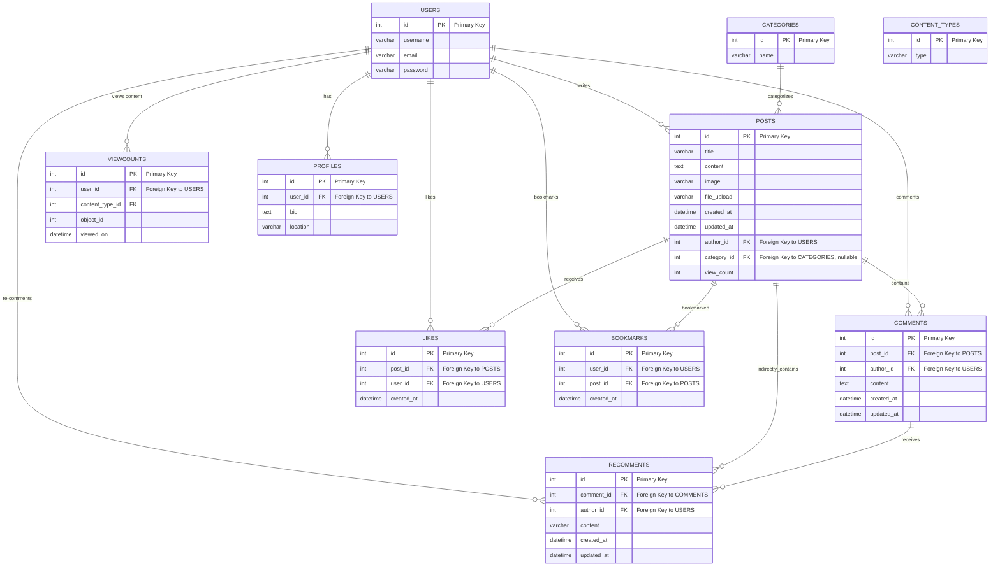

# 인공지능 물류 예측 모델 서비스 

## 1. 목표와 기능

### 1.1 목표
- 반복적으로 재고 수량 오차가 발생하는 물류 회사의 재고 수량을 사전 예측하는 
가상의 인공지능 개발사 랜딩 페이지와 블로그 기능 개발
- 인공지능 개발사 랜딩 페이지 물류 챗봇 연동

### 1.2 기능
- 공통
    - 헤더 - 로그인 / 로그아웃
    - 헤더 - 프로필
    - 헤더 - About, Services, Pricing, Contact 페이지
    - 헤더 - 네비게이션(홈 링크)
- 메인 화면
    - 검색
    - 물류 챗봇 질의
- 서비스 화면
    - 게시글 Create, Read
- 상세 화면
    - 게시글 Update, Delete
    - 제목, 작성자, 조회수, 작성 시간, 수정 시간, 카테고리
    - 이미지, 본문, 파일 다운로드, 댓글 CRUD, 대댓글 CRUD
- 로그인 화면
    - 일반 로그인
    - 회원가입
- 프로필 화면
    - 프로필 이미지
    - 프로필 편집
- 프로필 편집 화면
    - 이름, 성, 닉네임, 프로필사진, 비밀번호 수정

### 1.3 팀 구성
<table>
	<tr>
		<th>박주형</th>
		<th>이재원</th>
		<th>기준하</th>
		<th>김민규</th>
		<th>한승일</th>
	</tr>
 	<tr>
		<td>개발 리드</td>
		<td>기획</td>
		<td>인공지능 챗봇 개발</td>
		<td>댓글 기능 개발</td>
		<td>유저 기능 개발</td>
	</tr>
</table>

## 2. 개발 환경 및 배포 URL
### 2.1 개발 환경
- Web Framework
  - Django 4.2.11 (Python 3.11.7)
- 서비스 배포 환경
  - Amazon Lightsail
### 2.2 배포 URL
- URL
- 테스트용 계정
  ```
  id : test
  pw : test1234!
  ```

### 2.3 URL 구조(마이크로식)

- accounts 앱
  
| app:accounts      | HTTP Method | 설명           | 로그인 권한 필요 | 작성자 권한 필요 |
|-------------------|-------------|----------------|------------------|------------------|
| profile/          | GET         | 프로필 조회     | ✅               | ✅               |
| profile/delete/   | DELETE      | 프로필 삭제     | ✅               | ✅               |
| profile/update/   | PUT         | 프로필 전체 수정 | ✅               | ✅               |
| profile/update/   | PATCH       | 프로필 부분 수정 | ✅               | ✅               |
| signup/           | POST        | 회원가입        |                  |                  |
| token/            | POST        | 로그인 토큰 발급 |                  |                  |
| token/refresh/    | POST        | 만료 토큰 재발급 |                  |                  |


- posts 앱
  
| app:posts          | HTTP Method | 설명               | 로그인 권한 필요 | 작성자 권한 필요 |
|--------------------|-------------|---------------------|------------------|------------------|
| {id}/              | GET         | 게시물 상세 조회    |                  |                  |
| {id}/delete/       | DELETE      | 게시물 삭제         | ✅               | ✅               |
| {id}/like/         | POST        | 게시물 좋아요       | ✅               |                  |
| {id}/unlike/       | DELETE      | 게시물 좋아요 취소   | ✅               |                  |
| {id}/update/       | PUT         | 게시물 수정         | ✅               | ✅               |
| {id}/update/       | PATCH       | 게시물 부분 수정    | ✅               | ✅               |
| create/            | POST        | 게시물 작성         | ✅               |                  |
| list/              | GET         | 게시판 리스트 조회  |                  |                  |
| bookmarks/         | GET         | 북마크 조회          | ✅               |                  |
| bookmarks/{id}/    | DELETE      | 북마크 삭제          | ✅               |                  |
| bookmarks/create/  | POST        | 북마크 생성          | ✅               |                  |
| categories/        | GET         | 카테고리 조회        |                  |                  |

- comments 앱

| app:comments | HTTP Method | 설명                     | 로그인 권한 필요 | 작성자 권한 필요 |
|--------------|-------------|---------------------------|------------------|-------------------|
| comments     | GET         | /api/posts/{post_id}/comments/ | 게시물 댓글 조회 |                |   |
| comments     | GET         | /api/posts/{post_id}/comments/{id}/ | 댓글 상세 조회 |              |   |
| comments     | PUT         | /api/posts/{post_id}/comments/{id}/ | 댓글 수정 | ✅            | ✅ |
| comments     | PATCH       | /api/posts/{post_id}/comments/{id}/ | 댓글 부분 수정 | ✅         | ✅ |
| comments     | DELETE      | /api/posts/{post_id}/comments/{id}/ | 댓글 삭제 | ✅            | ✅ |
| comments     | POST        | /api/posts/{post_id}/comments/create/ | 댓글 작성 | ✅           |   |

- schema 앱
  
|app:schema|HTTP Method|설명|로그인 권한 필요|작성자 권한 필요|
|:-|:-|:-|:-:|:-:|
|schema/|GET|API 스키마 조회|||


## 3. 요구사항 명세와 기능 명세
### 3.1 요구사항 명세
- **(필수)인공지능 개발사 랜딩 페이지:**
    - 회사 소개, 서비스 소개, 연락처 등의 기본 정보를 제공
        - 재고 수량 예측 서비스의 특징과 이점 설명
        - 사용자가 문의할 수 있는 연락처 정보와 양식 제공
        - 반응형 웹 디자인(부트스트랩)을 적용하여 다양한 기기에서 접근 가능
- **(필수)블로그 기능:**
    - 물류 산업 동향, 재고 관리 팁, 회사 소식 등 관련 콘텐츠를 게시할 수 있는 블로그 기능 구현
        - 게시물 작성, 수정, 삭제 기능 제공
        - 카테고리, 태그 등을 활용하여 게시물을 분류 및 검색
        - 사용자 댓글 기능을 통해 방문자와의 소통을 활성화
- **(챌린지)데이터 처리 및 예측:**
    - 사용자가 제공한 1년 연간 재고 수량 데이터를 처리하고 분석할 수 있는 챗봇 기능 구현
        - 사용자의 연간 주문량 엑슬 워크시트 입력 데이터를 기반으로 재고 수량 예측 결과를 사용자에게 제공
- (**필수)보안 및 개인정보 보호:**
    - 사용자의 개인정보와 데이터를 안전하게 보호할 수 있는 보안 체계 마련
        - 데이터 암호화, 접근 제어, 로그 관리 등의 보안 조치 적용
        - 개인정보 처리 방침을 수립하고 이를 사용자에게 공개


### 3.2 기능 명세


## 4. 프로젝트 구조와 개발 일정
### 4.1 프로젝트 구조
```
📦ai-inventory-forecasting
┣ 📂.github
 ┃ ┣ 📂ISSUE_TEMPLATE
 ┃ ┃ ┣ 📜bug_report.md
 ┃ ┃ ┣ 📜custom.md
 ┃ ┃ ┗ 📜feature_request.md
 ┃ ┗ 📜PULL_REQUEST_TEMPLATE.md
 ┣ 📂.vscode
 ┃ ┗ 📜settings.json
 ┣ 📂accounts
 ┃ ┣ 📂migrations
 ┃ ┃ ┗ 📜__init__.py
┃ ┣ 📜admin.py
 ┃ ┣ 📜apps.py
 ┃ ┣ 📜models.py
 ┃ ┣ 📜serializers.py
 ┃ ┣ 📜tests.py
 ┃ ┣ 📜urls.py
 ┃ ┣ 📜views.py
 ┃ ┗ 📜__init__.py
 ┣ 📂comments
 ┃ ┣ 📂migrations
 ┃ ┃ ┗ 📜__init__.py
 ┃ ┣ 📜admin.py
 ┃ ┣ 📜apps.py
 ┃ ┣ 📜models.py
 ┃ ┣ 📜serializers.py
 ┃ ┣ 📜tests.py
 ┃ ┣ 📜urls.py
 ┃ ┣ 📜views.py
 ┃ ┗ 📜__init__.py
 ┣ 📂config
 ┃ ┣ 📜asgi.py
 ┃ ┣ 📜settings.py
 ┃ ┣ 📜urls.py
 ┃ ┣ 📜wsgi.py
 ┃ ┗ 📜__init__.py
 ┣ 📂media
┣ 📂posts
 ┃ ┣ 📂migrations
 ┃ ┃ ┗ 📜__init__.py
 ┃ ┣ 📜admin.py
 ┃ ┣ 📜apps.py
 ┃ ┣ 📜factories.py
 ┃ ┣ 📜models.py
 ┃ ┣ 📜serializers.py
 ┃ ┣ 📜tests.py
 ┃ ┣ 📜urls.py
 ┃ ┣ 📜views.py
 ┃ ┗ 📜__init__.py
 ┣ 📜.flake8
 ┣ 📜.gitignore
 ┣ 📜.pre-commit-config.yaml
 ┣ 📜db.sqlite3
 ┣ 📜manage.py
 ┣ 📜pyproject.toml
 ┣ 📜README.md
 ┗ 📜requirements.txt
```

### 4.1 개발 일정(WBS)
* 아래 일정표는 머메이드로 작성했습니다.


## 5. 와이어프레임 / UI / BM

### 5.1 와이어프레임
<table>
    <tbody>
        <tr>
            <td>랜딩 페이지</td>
            <td>로그인 랜딩 페이지</td>
        </tr>
        <tr>
            <td>
		
            </td>
            <td>
                
            </td>
        </tr>
        <tr>
            <td>로그인</td>
            <td>소개 페이지</td>
        </tr>
        <tr>
            <td>
                
            </td>
            <td>
                
            </td>
        </tr>
        <tr>
            <td>서비스 페이지</td>
        </tr>
        <tr>
            <td>
                
            </td>
        </tr>
    </tbody>
</table>

### 5.2 화면 설계
- 화면은 gif파일로 업로드해주세요.
 
<table>
    <tbody>
        <tr>
            <td>메인</td>
            <td>로그인</td>
        </tr>
        <tr>
            <td>
		
            </td>
            <td>
                
            </td>
        </tr>
        <tr>
            <td>회원가입</td>
            <td>정보수정</td>
        </tr>
        <tr>
            <td>
                
            </td>
            <td>
                
            </td>
        </tr>
        <tr>
            <td>검색</td>
            <td>번역</td>
        </tr>
        <tr>
            <td>
                
            </td>
            <td>
                
            </td>
        </tr>
        <tr>
            <td>선택삭제</td>
            <td>글쓰기</td>
        </tr>
        <tr>
            <td>
	        
            </td>
            <td>
                
            </td>
        </tr>
        <tr>
            <td>글 상세보기</td>
            <td>댓글</td>
        </tr>
        <tr>
            <td>
                
            </td>
            <td>
                
            </td>
        </tr>
    </tbody>
</table>


## 6. 데이터베이스 모델링(ERD)



## 7. Architecture

* 아래 Architecture 설계도는 ChatGPT에게 아키텍처를 설명하고 mermaid로 그려달라 요청한 것입니다.


## 8. 에러와 에러 해결


## 9. 개발하며 느낀점

